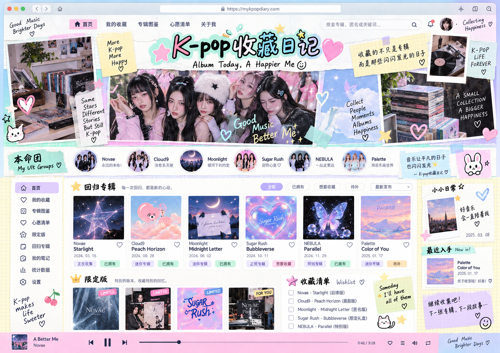
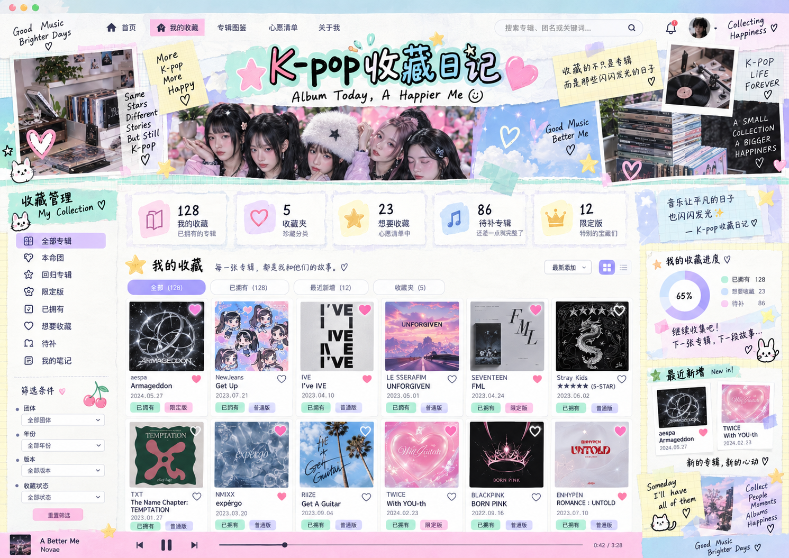
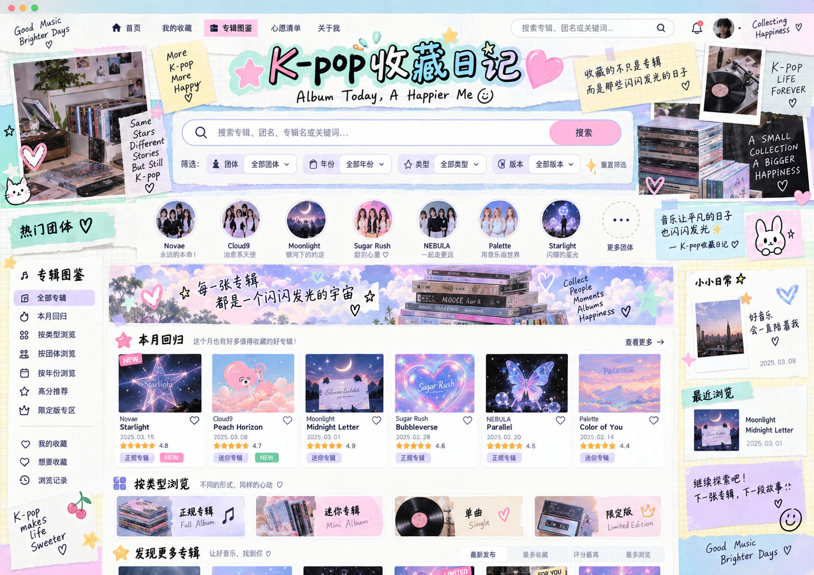
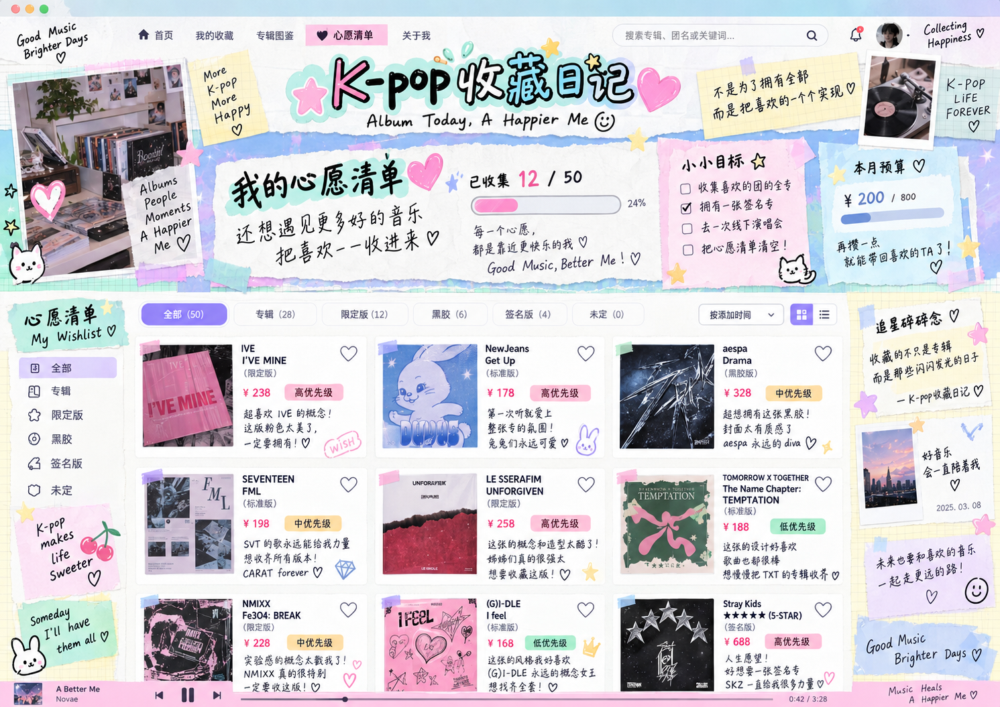
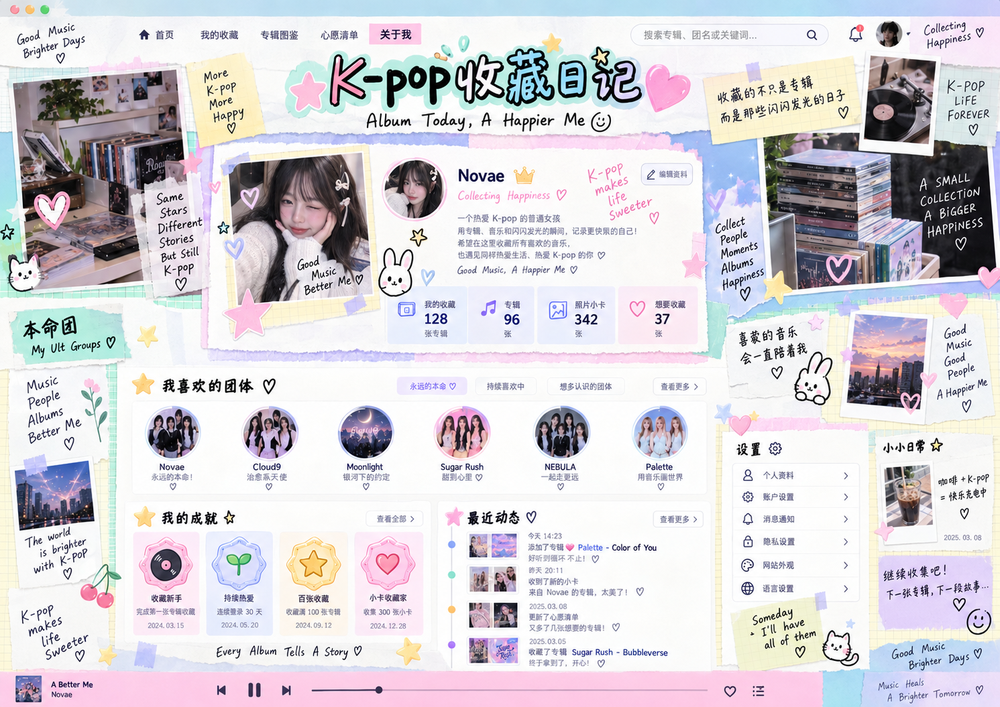

# 最终视觉目标：K-pop 收藏日记（Desktop Scrapbook）

> **本目录是本项目 UI/UX 的最终视觉基准。** 后续页面重构、Codex 开发和视觉验收，优先以这里的参考图为准。目标是“桌面端 K-pop 私人收藏手账 / scrapbook”，不要回退到深色 Dashboard、极简 SaaS、电商商城或手机 App 风格。

## 视觉基准图

### 高清原图（当前验收基准）

用户于 2026-09-13 补充五张高清 PNG，已保存于 `originals/`，以下链接以原图为准。旧 `reference-style.webp` 损坏，旧页面 WebP 仅为缩略图，暂留存档，不再作为更高优先级依据。

### 1. 首页

### 2. 我的收藏

### 3. 专辑图鉴

### 4. 心愿清单

### 5. 关于我

> 高清原图仅用于开发和评审，不作为生产页面背景。实际界面使用真实团体、专辑和用户数据。

## 不可偏离的设计语言

- **桌面网页优先**：主设计画布以 1440px / 1536px 桌面宽度为基准；移动端只做响应式适配，不反过来主导桌面视觉。
- **粉彩手账 / scrapbook**：奶油白纸张背景，搭配淡粉、薄荷绿、淡紫、天空蓝、少量黄色点缀。
- **真实纸张感**：撕纸边、Washi 胶带、方格纸、Polaroid、便利贴、手绘线条、轻微旋转与层叠关系。
- **手绘装饰**：爱心、星星、兔子、樱桃、涂鸦、手写短句可以丰富页面，但不能压过专辑内容本身。
- **顶部品牌统一**：中文导航 + 大号 `K-pop 收藏日记` 手绘标题 + `Album Today, A Happier Me ☺` 副标题 + 跨团体搜索。
- **高信息密度但不拥挤**：通过纸片分区、留白、柔和阴影和清晰层级展示更多专辑，而不是传统 Dashboard 卡片堆叠。
- **专辑是真正主角**：真实封面、团体圆头像、年份、版本、收藏状态、Wishlist 状态必须清晰易扫读。
- **桌面三栏骨架**：左侧收藏/筛选导航，中间专辑主内容，右侧日记/最近收录/碎碎念；根据页面内容允许局部调整，但整体气质保持一致。
- **粉色底部播放器**：作为桌面端统一视觉元素和未来音乐功能入口；未接音频时也可作为装饰性组件存在。
- **文案气质**：个人、温柔、快乐、有陪伴感，核心关键词是“收藏、回忆、音乐、日记、幸福感”。

## 明确禁止的方向

后续实现不得重新变成以下风格：

- 深色霓虹 / Cyberpunk；
- 企业后台 / 数据 Dashboard；
- 极简白色 SaaS；
- 商品购买导向的电商商城；
- 原生手机 App 式的大按钮、底栏主导布局；
- 每个页面独立一套模板，导致全站视觉不统一。

## 页面实现优先级

1. 统一全站 Design Tokens：颜色、纸张背景、阴影、圆角、胶带、便签、字体层级、间距。
2. 统一顶部导航、搜索、页面容器和桌面底部播放器。
3. 首页按 `originals/01-home.png` 收敛。
4. 我的收藏按 `originals/02-my-collection.png` 收敛。
5. 专辑图鉴按 `originals/03-album-gallery.png` 收敛。
6. 心愿清单按 `originals/04-wishlist.png` 收敛。
7. 关于我按 `originals/05-about-me.png` 收敛。
8. 最后做 Tablet / Mobile 响应式适配，不牺牲桌面端的 scrapbook 视觉。

## 功能原则

视觉升级不能破坏现有功能。SQLite 数据模型、Group → Album → AlbumVersion 层级、CRUD、图片上传、收藏状态、Wishlist、备份和现有 API 应继续复用；优先做展示层和交互层重构。

## 验收标准

- 1440px / 1536px 桌面宽度打开时，第一眼必须与 五张高清原图属于同一本 K-pop 收藏手账。
- 五个核心页面必须共享同一套纸张、胶带、便签、字体、色彩和导航语言。
- 真实数据替代效果图中的示例内容后，页面仍保持同样的层次与氛围。
- 页面可以丰富，但不能重新产生明显的“后台管理系统感”。
- 任何新页面设计前，先对照本目录，再进行实现。
